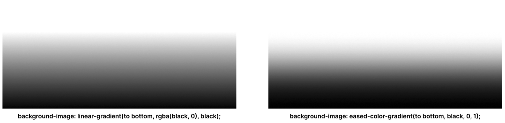

# Eased color gradient

Linear color gradient with eased edge transitions.

Adaptation of [Easing Linear Gradients by Andreas Larsen](https://css-tricks.com/easing-linear-gradients/).



## Setup

```scss
@function eased-color-gradient(
  $direction,
  $color,
  $start-opacity,
  $end-opacity
) {
  $eased-opacities: 0, 0.0086, 0.0355, 0.0817, 0.1472, 0.2318, 0.3319, 0.4427,
    0.5573, 0.6681, 0.7682, 0.8526, 0.9183, 0.9645, 0.9914, 1;

  $gradient: "";

  @for $i from 1 through length($eased-opacities) {
    $stop: calc((1 / (length($eased-opacities) - 1)) * ($i - 1));
    $stop-rounded: calc(round($stop * 1000) / 1000);
    $opacity: ($end-opacity - $start-opacity) *
      nth($eased-opacities, $i) +
      $start-opacity;
    $color: rgba($color, $opacity);

    $gradient: $gradient + ", " + $color + " " + $stop-rounded * 100%;
  }

  @return unquote("linear-gradient(" + $direction + $gradient + ")");
}
```

#### Options

| Variable           | Value type                      | Description                  |
| :----------------- | :------------------------------ | :--------------------------- |
| `$eased-opacities` | list of numbers between 0 and 1 | Easing for each opacity stop |

## Usage

```scss
.class {
  background-image: eased-color-gradient(
    <direction>,
    <color>,
    <start-opacity>,
    <end-opacity>
  );
}
```

#### Parameters

| Parameter       | Value type                                                                                                | Description                                                                         |
| :-------------- | :-------------------------------------------------------------------------------------------------------- | :---------------------------------------------------------------------------------- |
| `direction`     | [side, corner or angle](https://developer.mozilla.org/en-US/docs/Web/CSS/gradient/linear-gradient#values) | Direction of the gradient line                                                      |
| `color`         | [color](https://developer.mozilla.org/en-US/docs/Web/CSS/color_value)                                     | Color for which the gradient is generated; uses solid variant of the provided color |
| `start-opacity` | [opacity](https://developer.mozilla.org/en-US/docs/Web/CSS/opacity#values)                                | Target starting opacity of the gradient                                             |
| `end-opacity`   | [opacity](https://developer.mozilla.org/en-US/docs/Web/CSS/opacity#values)                                | Target ending opacity of the gradient                                               |

#### Example

To generate an eased `black` colored gradient with `0` opacity at the top and `1` opacity at the bottom:

```scss
.class {
  background-image: eased-color-gradient(to bottom, black, 0, 1);

  /*
  background-image: linear-gradient(
    to bottom, 
    rgba(0, 0, 0, 0) 0%, 
    rgba(0, 0, 0, 0.0086) 6.7%, 
    rgba(0, 0, 0, 0.0355) 13.3%, 
    rgba(0, 0, 0, 0.0817) 20%, 
    rgba(0, 0, 0, 0.1472) 26.7%, 
    rgba(0, 0, 0, 0.2318) 33.3%, 
    rgba(0, 0, 0, 0.3319) 40%, 
    rgba(0, 0, 0, 0.4427) 46.7%, 
    rgba(0, 0, 0, 0.5573) 53.3%, 
    rgba(0, 0, 0, 0.6681) 60%, 
    rgba(0, 0, 0, 0.7682) 66.7%, 
    rgba(0, 0, 0, 0.8526) 73.3%, 
    rgba(0, 0, 0, 0.9183) 80%, 
    rgba(0, 0, 0, 0.9645) 86.7%, 
    rgba(0, 0, 0, 0.9914) 93.3%, 
    black 100%
  );
  */
}
```
