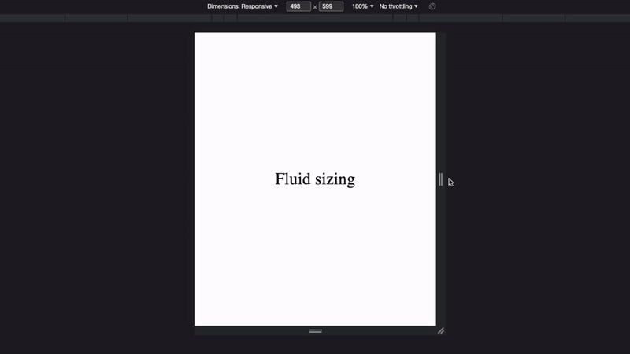

# Fluid

Dynamic linear value scaling based on viewport width.



## Setup

```scss
$minViewport: 375;
$maxViewport: 1920;
$minCap: true;
$maxCap: true;

@mixin fluid($property, $minValue, $maxValue) {
  $x: calc(($maxValue - $minValue) / ($maxViewport - $minViewport));
  $y: $maxValue - $maxViewport * $x;
  #{$property}: calc(#{100 * $x}vw + #{$y}px);

  @if $minCap {
    @media screen and (max-width: ($minViewport - 1px)) {
      #{$property}: #{$minValue}px;
    }
  }

  @if $maxCap {
    @media screen and (min-width: ($maxViewport + 1px)) {
      #{$property}: #{$maxValue}px;
    }
  }
}
```

| Variable       | Value type     | Description                                                                        |
| :------------- | :------------- | :--------------------------------------------------------------------------------- |
| `$minViewport` | number in `px` | Viewport width for which the `$minValue` will be applied                           |
| `$maxViewport` | number in `px` | Viewport width for which the `$maxValue` will be applied                           |
| `$minCap`      | boolean        | Cap any return value below viewport width of `$minViewport` to the lower set limit |
| `$maxCap`      | boolean        | Cap any return value above viewport width of `$maxViewport` to the upper set limit |

## Usage

```scss
.class {
  @include fluid(<css-property>, <min-size-px>, <max-size-px>);
}
```

| Variable       | Value type     | Description                                                                                            |
| :------------- | :------------- | :----------------------------------------------------------------------------------------------------- |
| `css-property` | CSS property   | Target CSS property for which the scaling will be applied                                              |
| `min-size-px`  | number in `px` | Size in pixels which the target CSS property will have when the viewport is `$minViewport` pixels wide |
| `max-size-px`  | number in `px` | Size in pixels which the target CSS property will have when the viewport is `$maxViewport` pixels wide |

#### Example

To set `font-size` to `32px` at viewport width of `375px`, `64px` at viewport width of `1920px`, and dynamically scale the size at any viewport width in-between:

```css
.class {
  @include fluid(font-size, 32, 64);

  /*
  font-size: calc(2.071197411vw + 24.2330097087px);

  @media screen and (max-width: 374px) {
    font-size: 32px;
  }

  @media screen and (max-width: 1921px) {
    font-size: 64px;
  }
  */
}
```
